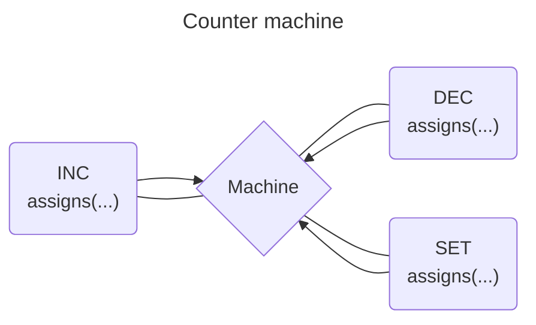
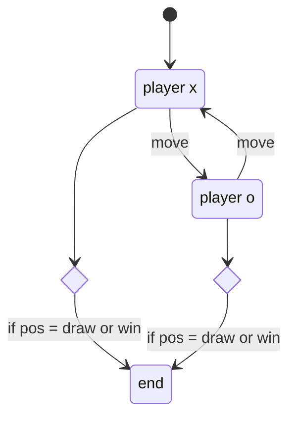

# XFsm

[](https://github.com/heywhy/xfsm/actions) [](https://github.com/heywhy/xfsm/actions) [](https://codecov.io/gh/heywhy/xfsm)

XFsm is a declarative finite state machine library for [Elixir](https://elixir-lang.org/).

It uses [event-driven](./docs/transitions.md) programming, [state machines](./docs/state-machines.md) and actors to handle complex logic in predictable and robust ways.

It provides very easy to use APIs which makes looking at a declaration very easy to understand.

## Installation

The package can be installed by adding `xfsm` to your list of dependencies in `mix.exs`:

```elixir
def deps do
  [
    {:xfsm, "~> 0.5.0"}
  ]
end
```

## Documentation

API documentation is available at <https://hexdocs.pm/xfsm>

## Create a simple machine

```elixir
defmodule Counter do
  use XFsm.Actor
  use XFsm.Machine

  import XFsm.Actions

  context(%{count: 0})

  on :inc do
    action(assigns(%{count: & &1.context.count + 1}))
  end

  on :dec do
    action(assigns(%{count: & &1.context.count - 1}))
  end

  on :set do
    action(assigns(%{count: & &1.event.value}))
  end
end

alias XFsm.Actor

{:ok, pid} = Counter.start_link()

Actor.subscribe(pid, fn %{context: %{count: count}} ->
  IO.puts(count)
end)

Actor.send(pid, %{type: :inc})
# logs 1

Actor.send(pid, %{type: :dec})
# logs 0

Actor.send(pid, %{type: :set, value: 10})
# logs 10
```



## Create a complex machine

```elixir
defmodule TicTacToe do
  use XFsm.Actor
  use XFsm.Machine

  import XFsm.Actions

  defmodule Board do
    defstruct squares: {nil, nil, nil, nil, nil, nil, nil, nil, nil}

    @tags [:x, :o]

    def square(%__MODULE__{} = board, index)
        when is_integer(index) and index >= 1 and index <= 9 do
      elem(board.squares, index - 1)
    end

    def empty?(%__MODULE__{} = board, index), do: square(board, index) == nil

    def has_empty_square?(%__MODULE__{} = board) do
      Enum.any?(0..8, &(elem(board.squares, &1) == nil))
    end

    def draw?(%__MODULE__{} = board) do
      not has_empty_square?(board) and
        not (won?(board, :x) or won?(board, :o))
    end

    def won?(%__MODULE__{} = board, tag) when tag in @tags do
      %{squares: squares} = board

      siblings?(:x, squares, tag) or
        siblings?(:y, squares, tag) or
        siblings?(:z, squares, tag)
    end

    def put(%__MODULE__{} = board, index, tag)
        when is_integer(index) and index >= 1 and index <= 9 and tag in @tags do
      case empty?(board, index) do
        false ->
          board

        true ->
          squares = put_elem(board.squares, index - 1, tag)

          %__MODULE__{board | squares: squares}
      end
    end

    def to_iodata(%__MODULE__{} = board) do
      Enum.reduce(0..2, [], fn i, acc ->
        row = Enum.map_join(0..2, "|", &(elem(board.squares, i * 3 + &1) || "-"))

        Enum.concat(acc, ["|", row, "|\n"])
      end)
    end

    defp siblings?(:x, squares, tag) do
      Enum.reduce_while(0..2, false, fn i, acc ->
        fun? = &(elem(squares, i * 3 + &1) == tag)

        case Enum.all?(0..2, fun?) do
          true -> {:halt, true}
          false -> {:cont, acc}
        end
      end)
    end

    defp siblings?(:y, squares, tag) do
      Enum.reduce_while(0..2, false, fn i, acc ->
        fun? = &(elem(squares, i + &1 * 3) == tag)

        case Enum.all?(0..2, fun?) do
          true -> {:halt, true}
          false -> {:cont, acc}
        end
      end)
    end

    defp siblings?(:z, squares, tag) do
      fun? = &(elem(squares, &1) == tag)

      Enum.all?(0..8//4, fun?) or Enum.all?(2..6//2, fun?)
    end
  end

  initial(:x)
  context(%{input: i}, do: context_from_input(i))

  state :x do
    on :move do
      target(:o)
      guard(%{method: :can_move?, params: %{player: :x}})
      action(:make_move)
    end
  end

  state :o do
    on :move do
      target(:x)
      guard(%{method: :can_move?, params: %{player: :o}})
      action(:make_move)
    end
  end

  state :end do
    # You most likely want to persist the game state and terminate the
    # process, assuming you're building an online multiplayer game.
  end

  root do
    always do
      target(:end)
      guard(%{method: :won?, params: %{player: :o}})
      action(assigns(%{winner: :o}))
    end

    always do
      target(:end)
      guard(%{method: :won?, params: %{player: :x}})
      action(assigns(%{winner: :x}))
    end

    always do
      target(:end)
      guard(%{method: :drawn?, params: %{player: :x}})
    end
  end

  defg can_move?(
         %{context: %{x: x}, event: %{ref: x, square: s}} = arg,
         %{player: :x}
       )
       when is_integer(s) and s >= 1 and s <= 9 do
    %{context: %{board: board}, event: %{square: square}} = arg

    Board.empty?(board, square)
  end

  defg can_move?(
         %{context: %{o: o}, event: %{ref: o, square: s}} = arg,
         %{player: :o}
       )
       when is_integer(s) and s >= 1 and s <= 9 do
    %{context: %{board: board}, event: %{square: square}} = arg

    Board.empty?(board, square)
  end

  defg won?(
         %{self: %{state: _}, context: %{board: _}} = arg,
         %{player: player} = params
       )
       when player in [:x, :o] do
    %{self: %{state: state}, context: %{board: board}} = arg
    %{player: player} = params

    state != :end and Board.won?(board, player)
  end

  defg drawn?(%{self: %{state: _}, context: %{board: _}} = arg) do
    %{self: %{state: state}, context: %{board: board}} = arg

    state != :end and Board.draw?(board)
  end

  defa make_move(%{context: %{x: x} = c, event: %{ref: x, square: s}})
       when is_integer(s) and s >= 1 and s <= 9 do
    %{board: board} = c
    board = Board.put(board, s, :x)

    %{c | board: board}
  end

  defa make_move(%{context: %{o: o} = c, event: %{ref: o, square: s}})
       when is_integer(s) and s >= 1 and s <= 9 do
    %{board: board} = c
    board = Board.put(board, s, :o)

    %{c | board: board}
  end

  defp context_from_input(%{x: x, o: o})
       when is_reference(x) and is_reference(o) do
    %{x: x, o: o, winner: :none, board: %Board{}}
  end
end

alias XFsm.Actor

# We're using references so that a player does not make a move for the other.
# These can be user id assuming you're building an online multiplayer game.
x = make_ref()
o = make_ref()

{:ok, pid} = TicTacToe.start_link(input: %{x: x, o: o})

Actor.subscribe(pid, fn %{context: %{board: b, winner: w}} ->
  iodata = TicTacToe.Board.to_iodata(b)

  IO.puts([iodata | ["\n", "winner: ", Atom.to_string(w)]])
end)

:ok = Actor.send(pid, %{type: :move, ref: x, square: 5})
:ok = Actor.send(pid, %{type: :move, ref: o, square: 3})
:ok = Actor.send(pid, %{type: :move, ref: x, square: 6})
:ok = Actor.send(pid, %{type: :move, ref: o, square: 1})
:ok = Actor.send(pid, %{type: :move, ref: x, square: 4})

XFsm.Actor.snapshot(pid)
```



## License

MIT
