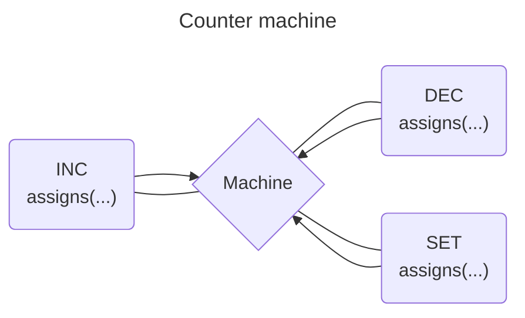

# XFsm

[](https://github.com/heywhy/xfsm/actions) [](https://github.com/heywhy/xfsm/actions) [](https://codecov.io/gh/heywhy/xfsm)

XFsm is a declarative finite state machine library for [Elixir](https://elixir-lang.org/).

It uses [event-driven](./docs/transitions.md) programming, [state machines](./docs/state-machines.md) and actors to handle complex logic in predictable and robust ways.

It provides very easy to use APIs which makes looking at a declaration very easy to understand.

## Installation

The package can be installed by adding `xfsm` to your list of dependencies in `mix.exs`:

```elixir
def deps do
  [
    {:xfsm, "~> 0.3.0"}
  ]
end
```

## Documentation

API documentation is available at <https://hexdocs.pm/xfsm>

## Create a simple machine

```elixir
defmodule Counter do
  use XFsm.Actor
  use XFsm.Machine

  import XFsm.Actions

  context(%{count: 0})

  on :inc do
    action(assigns(%{count: & &1.context.count + 1}))
  end

  on :dec do
    action(assigns(%{count: & &1.context.count - 1}))
  end

  on :set do
    action(assigns(%{count: & &1.event.value}))
  end
end

alias XFsm.Actor

{:ok, pid} = Counter.start_link()

Actor.subscribe(pid, fn %{context: %{count: count}} ->
  IO.puts(count)
end)

Actor.send(pid, %{type: :inc})
# logs 1

Actor.send(pid, %{type: :dec})
# logs 0

Actor.send(pid, %{type: :set, value: 10})
# logs 10
```



## License

MIT
