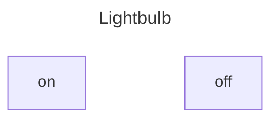
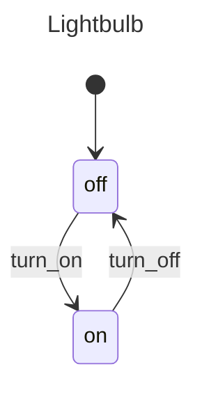
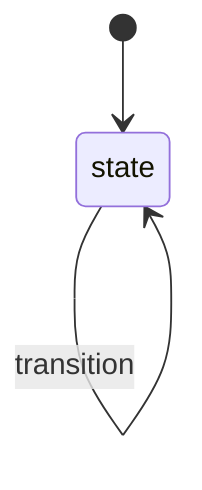

# What are State Machines?

State machines are models used to visualize how an object changes its state based on external events.

This model is essential in software engineering because it helps capture the various states of an entity, the events that trigger changes, and the transitions between these states. Additionally, it assists in identifying impossible states and undesirable transitions.

Some benefits of using a state machine include:

- They are simple to understand and can be easily communicated across different levels of an organization.
- They are easy to maintain and test because the states and transitions are deterministic.
- They provide a concise way to model complex application workflows.

## States

A state describes the condition of a machine at any given time.

For example, a lightbulb is either **on** or **off**; it can never be both simultaneously. Furthermore, it is **impossible** for it to be neither **on** nor **off**.



In the example above, there are only two states, which are *finite*.

When a machine starts, it first enters the **initial state**. A machine cannot have multiple initial states because it wouldn't be able to determine which state to enter.

> #### Info {: .info}
>
> A state machine can only be in one state at a time.

[Read more about states](./state.md)

### States in XFsm

In XFsm, states are defined using the `state` attribute.

```elixir
defmodule Lightbulb do
  use XFsm.Machine

  initial(:off)

  state :off do
  end

  state :on do
  end
end
```

## Transitions

The process of how a lightbulb goes from **off** to **on** is referred to as **transitions**. **Events** trigger transitions; when a known event occurs, the machine transitions to the next state.

The lightbulb alternates between **on** and **off** through the **turn_on** and **turn_off** events.

Transitions are deterministic; each combination of state and event always points to the same next state.



With its two finite states and transitions, this lightbulb process is a *Finite State Machine*. A state machine is used to describe the behavior of something. The machine outlines the thing’s states and the transitions between them. It’s considered a Finite State Machine because it has a finite number of states.

[Read more about transitions and events](./transitions.md)

### Events and Transitions in XFsm

Events and transitions are defined in XFsm state machines inside the `on` property of a state.

```elixir
defmodule Lightbulb do
  use XFsm.Machine

  initial(:off)

  state :off do
    on :turn_on, do: target(:on)
  end

  state :on do
    off :turn_off, do: target(:off)
  end
end
```

## Final State

Most processes with states will have a final state, which is the last state when the process is completed.

## Self-transition

Self-transition happens when an event occurs, but the transition returns to the same state. The transition arrows exits and re-enter the same state.

A helpful way to describe a self-transition is “doing something, not going somewhere” in the process.



[Read more about self transitions](./eventless-transitions.md)
